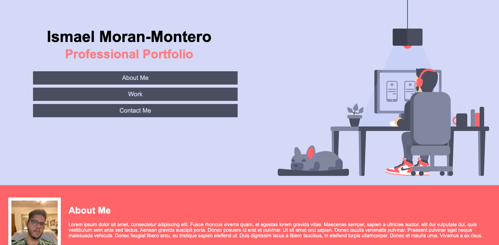
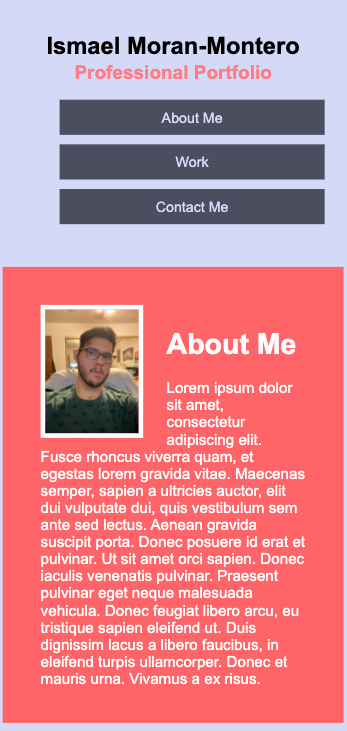

# Professional-Portfolio

## Overview
For this weeks assignment we were delegated update our professional portfolio along with our github accounts, resumes and linked in profile.

## Acceptance Criteria
* Updated portfolio featuring Project 1 and two exemplary homework assignments.

* Updated GitHub profile with pinned repositories featuring Project 1 and two exemplary assignments.

* Updated resume

* Updated LinkedIn profile

## Description

I have three sections one for About Me, Work and Contacts

My about me section contains a picture of me and text

My work section contains three work samples with clickable images

My Contact section contains three form of contact email, phone, git hub & linkedIn account link.

Once you resize the website to mobile it does the following

On mobile the image at the header disappear and the text for the header also shrink

All images and sections all appear in a row instead of grouped liked they were on a regular desktop.

  * 📖 [Portfolio Link](https://imoranmo.github.io/Professional-Portfolio/) 